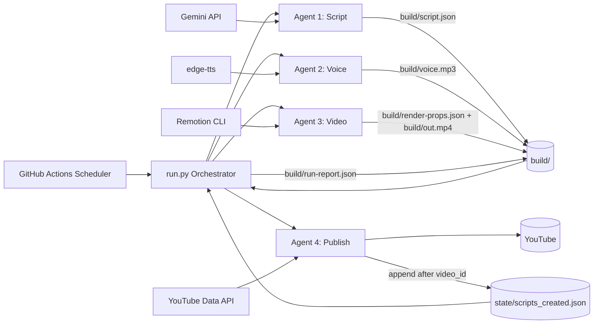
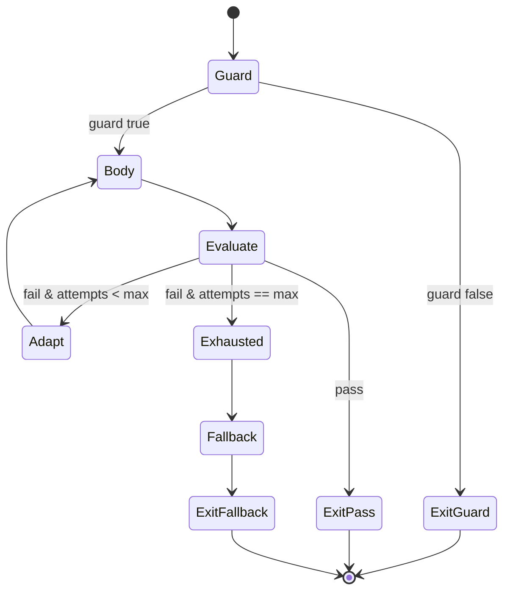
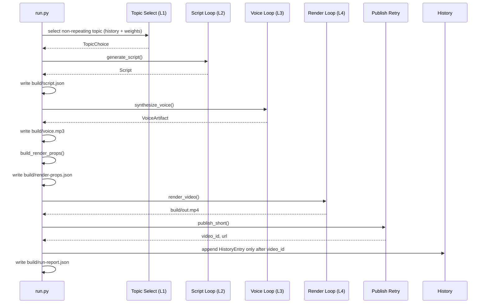
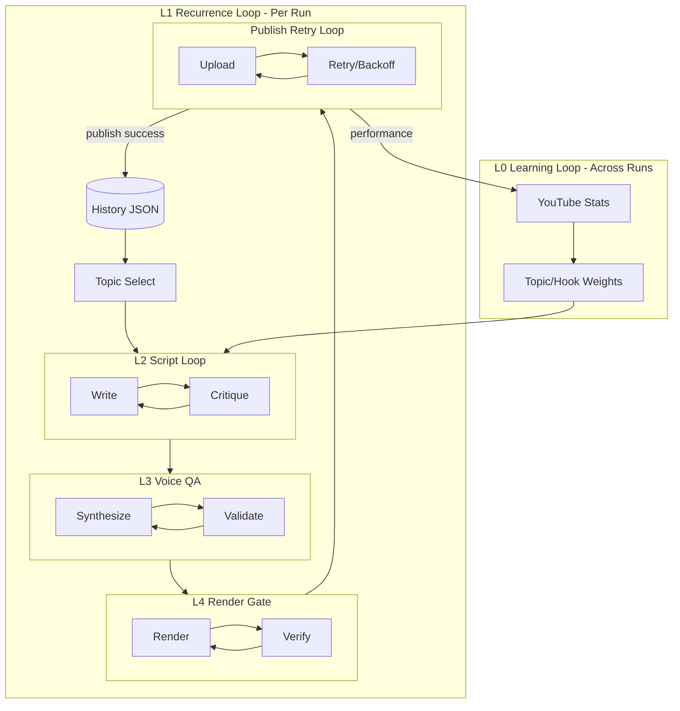
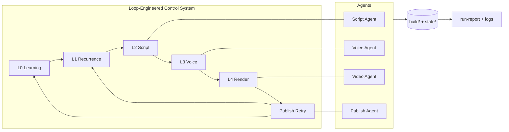

# AEC AI Shorts — Executive Technical Summary

## Audience
Council review packet for:
- Engineering Manager
- Enterprise Architect
- Development Manager

## 1) Executive Position
AEC AI Shorts is a loop-engineered automation system that produces one short-form AEC AI video per publishing slot using free-tool infrastructure.

The core architecture principle is **control-loop reliability**, not linear stage chaining:
- L0: Learning loop (across runs)
- L1: Recurrence loop (per run)
- L2: Script generate-critique loop
- L3: Voice QA loop
- L4: Render quality-gate loop
- Publish retry loop (bounded transient handling)

Operationally, this design reduces silent failure, enforces bounded convergence, and produces auditable run artifacts for governance.

## 2) System Architecture

### Architecture Notes
- No always-on server tier.
- No database dependency.
- State boundary is explicit and small: `state/scripts_created.json` + `build/`.
- Failure domains are isolated behind bounded loops and typed errors.

## 3) Loop-Engineering Contract
Every major stage loop is implemented via a common primitive (`run_loop`) with identical semantics:
- Guard predicate
- Body action
- Progress metric (best-so-far)
- Termination predicate
- Hard max-iteration cap
- Deterministic fallback or abort
- Structured iteration + exit observability

## 4) How Agents Work in Tandem

### Tandem Model (Implementation Reality)
- Only Script agent calls the LLM.
- Voice, Video, and Publish are deterministic controllers around adapters.
- Cross-agent handoff is file-contract based, which improves traceability and replayability.

## 5) Loop Topology and Data Feedback

## 6) Technical Deep Dive by Loop

### L0 Learning Loop
- Implemented in analytics path (`compute_learning`).
- Produces bucket weights used by topic selection and script prompting.
- Safe no-op behavior when disabled or insufficient stats.

### L1 Recurrence Loop
- Encoded in orchestration and history append invariant.
- Non-repetition enforced via history read + dedup logic before script generation.
- History append occurs only after confirmed `video_id`.

### L2 Script Loop
- Module: `pipeline/agent_script.py`.
- Writer and critic iterate through `run_loop`.
- On exhaustion: accepts best acceptable output or aborts with typed error.

### L3 Voice QA Loop
- Module: `pipeline/agent_voice.py`.
- Real duration probes and QA gates drive retries.
- Rate adaptation between attempts improves convergence.

### L4 Render Gate Loop
- Module: `pipeline/agent_video.py`.
- Rendering retries reduce cost profile on each attempt to survive transient runner faults.
- Final failure aborts run; no broken video proceeds.

### Publish Retry Loop
- Module: `pipeline/agent_publish.py`.
- Bounded retries over transient classes, capped exponential backoff.
- On success: writes immutable history entry for recurrence + learning.

## 7) Data Contracts and Artifact Flow
| Contract | Producer | Consumer | Purpose |
|---|---|---|---|
| `build/script.json` | Script loop | Voice loop / run audit | Script artifact for narration and traceability |
| `build/voice.mp3` | Voice loop | Render loop | Real audio source for timing |
| `build/render-props.json` | run orchestrator | Remotion renderer | Python-TS boundary contract |
| `build/out.mp4` | Render loop | Publish loop | Publishable output asset |
| `build/run-report.json` | run orchestrator | CI artifact / reviewers | Loop attempts, exits, outcomes |
| `state/scripts_created.json` | Publish loop | Topic selection, analytics | Recurrence memory and learning ledger |

## 8) Quality and Governance Signals
- Test inventory (collected): **199 tests**.
- Pipeline behavior is strongly test-oriented via dependency injection and mockable adapters.
- Run observability is explicit with structured events and a persisted run report.

### Governance Note
Documentation and review artifacts in the repo frame quality posture at full loop-level verification. The active CI workflow currently contains `--cov-fail-under=90` in `.github/workflows/daily-short.yml`, which should be aligned with council-approved quality policy before launch freeze.

## 9) Enterprise Architecture Assessment

### Strengths
- Deterministic orchestration with bounded retries.
- Clear data lineage and replayable artifacts.
- Minimal infrastructure footprint.
- Strong separation of business logic from external adapters.

### Design Trade-offs
- CI scheduler gate is implementation-critical for one-slot enforcement.
- External API boundaries remain operational risk surfaces (managed by retries + alerts).
- Stateless architecture simplifies ops but shifts reliability burden to strict artifact contracts.

## 10) Recommended Council Decisions
1. Approve loop-engineering pattern as the project control backbone.
2. Approve architecture for production pilot under artifact-based audit.
3. Align CI quality threshold and policy text as a single source of truth.
4. Approve operational runbook ownership for scheduler, secrets, and incident response.

## 11) Presentation Diagram (Council Slide Friendly)

---
Prepared from codebase modules in `pipeline/`, workflow definitions in `.github/workflows/`, and repository documentation.
