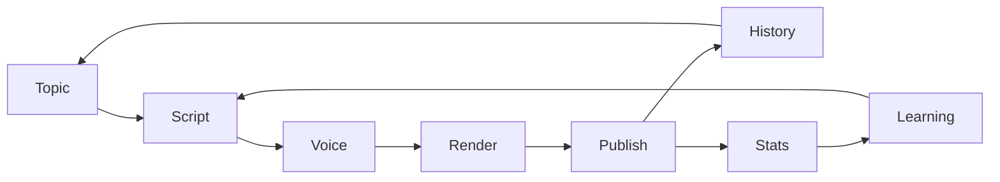
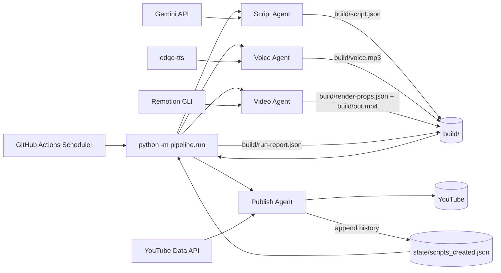
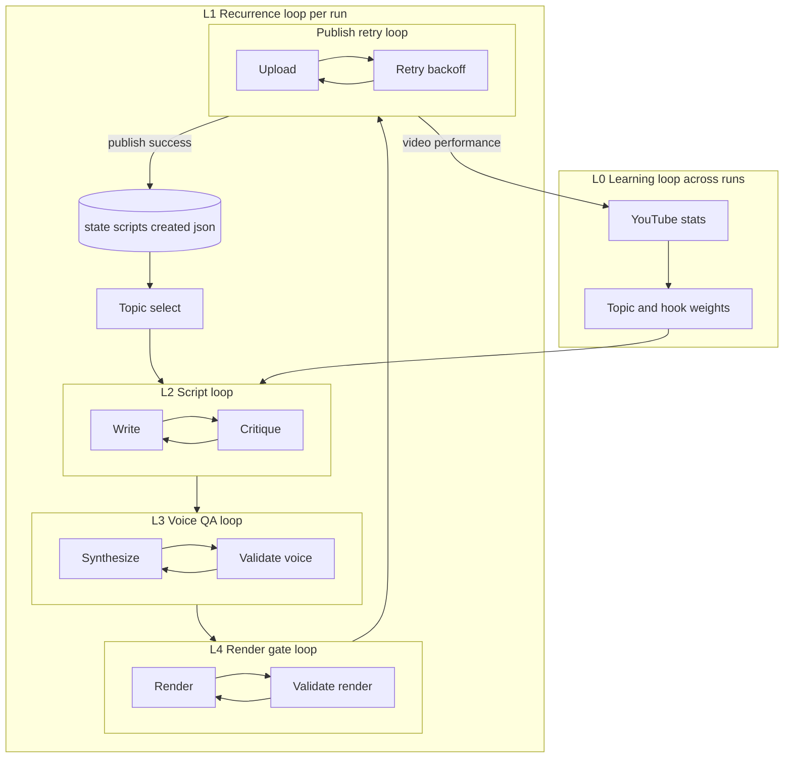
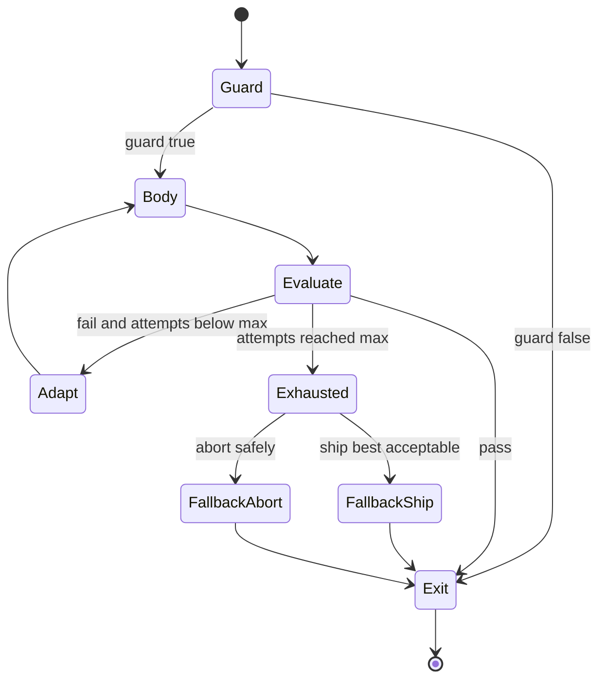
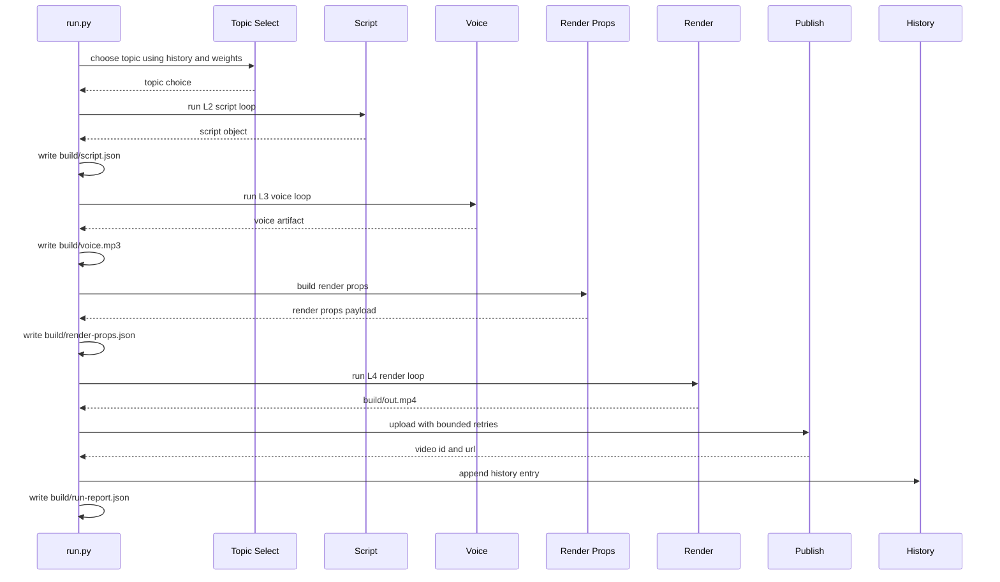
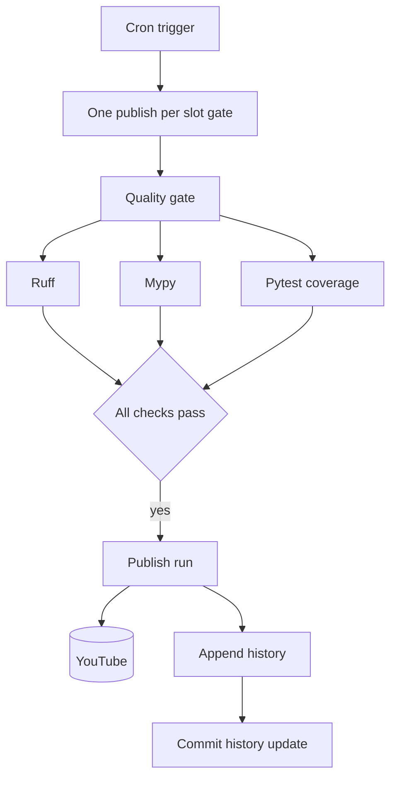

# 🚀 AEC AI Shorts


> A loop-engineered automation system that generates and publishes one **50–60 second vertical YouTube Short daily** about AI in the AEC industry.

AEC AI Shorts is a fully automated, free-tool content system focused on AI in the AEC industry, including Revit, Civil 3D, Navisworks, Autodesk Construction Cloud, BIM, MEP, digital twins, and related workflows.

The engineering idea is simple but powerful:

> **This is not a linear pipeline. It is a bounded feedback-control system.**

The system uses four agents:

- **Script Agent** - generates and critiques the script
- **Voice Agent** - creates and validates narration
- **Video Agent** - renders and checks the video
- **Publish Agent** - uploads with retry and records successful output

Only the **Script Agent** calls an LLM. Voice, Video, and Publish are deterministic controllers around tool adapters.

---

## 📌 Table of Contents

- [Why This Project Exists](#-why-this-project-exists)
- [How It Works in 60 Seconds](#-how-it-works-in-60-seconds)
- [Core Stack](#-core-stack)
- [Architecture](#-architecture)
- [Five-Loop Topology and Shared Contract](#-five-loop-topology-and-shared-contract)
- [Loop Contract](#-loop-contract)
- [Per-Run Flow](#-per-run-flow)
- [Repository Structure](#-repository-structure)
- [Quickstart](#-quickstart)
- [Configuration](#-configuration)
- [CI and Scheduling](#-ci-and-scheduling)
- [Testing Philosophy](#-testing-philosophy)
- [Security](#-security)
- [Why This Stands Out](#-why-this-stands-out)
- [Resume Positioning](#-resume-positioning)

---

## 🎯 Why This Project Exists

Most automation systems behave like fragile pipelines:

```text
Generate -> Render -> Upload -> Hope nothing breaks
```

AEC AI Shorts is different. It is designed around **repeatable control loops** that can evaluate, retry, fallback, and exit deterministically.

The reliability mechanism is not the individual agent. The reliability mechanism is the loop contract that every major stage follows.

---

## ⚡ How It Works in 60 Seconds

**Goal:** Automatically generate and publish one AI-powered AEC YouTube Short every day.

1. **Pick a Topic**
   - Uses history and learning weights
   - Prevents repeated topics
   - Runs inside the L1 recurrence loop

2. **Generate the Script**
   - Gemini creates the script
   - A critic evaluates it against quality rules
   - The system retries until the script reaches the quality threshold

3. **Generate the Voice**
   - Converts script to speech using `edge-tts`
   - Validates duration and narration quality
   - Retries when output does not meet constraints

4. **Render the Video**
   - Uses Remotion to create a vertical 1080x1920 video
   - Validates video output, size, duration, and render quality
   - Retries with bounded attempts

5. **Publish to YouTube**
   - Uploads the final short
   - Retries transient failures using backoff
   - Writes history only after YouTube returns a valid video id

6. **Learn for the Next Run**
   - Uses YouTube performance signals
   - Updates topic and hook weights
   - Feeds future script generation

### Mental Model



### Key Insight

```text
Pipeline systems execute once.
Loop systems self-correct until success or deterministic exit.
```

---

## 🧰 Core Stack

| Layer | Technology | Purpose |
|---|---|---|
| Orchestration | Python | Runs the full automation workflow |
| AI scripting | Gemini | Generates script candidates |
| Text-to-speech | edge-tts | Produces narration audio |
| Video rendering | Remotion + React + TypeScript | Creates vertical video output |
| Runtime | GitHub Actions | Free scheduled execution |
| State | Local JSON | Recurrence memory and run artifacts |
| Publishing | YouTube Data API | Uploads generated Shorts |

### Design Constraints

- No always-on server
- No database
- Free-tool first approach
- CI-scheduled execution
- Explicit local state boundary
- Bounded retries and deterministic exits

---

## 🏗 Architecture

**End-to-end architecture with scheduler, orchestrator, agents, artifacts, and external services.**



---

## 🔁 Five-Loop Topology and Shared Contract

**Caption:** L0 wraps L1. L1 mounts L2, L3, L4, and publish retry with explicit feedback edges.

> GitHub Mermaid note: this diagram avoids parentheses, slashes, and special characters in subgraph labels to prevent rendering errors.



---

## 🧩 Loop Contract

Each major loop follows the same reusable contract:

- Guard predicate
- Body action
- Evaluation result
- Best-so-far tracking
- Termination predicate
- Hard max-iteration cap
- Deterministic fallback or abort
- Structured iteration and exit observability



### Example Usage

```python
from pipeline.loops import run_loop

result = run_loop(
    "L2.script",
    body=lambda attempt, previous: writer.generate(attempt, previous),
    evaluate=lambda artifact: critic.evaluate(artifact),
    adapt=lambda artifact, evaluation: writer.refine(evaluation.feedback),
    on_exhausted=ship_best_or_abort,
    max_iters=cfg.script.max_attempts,
)
```

---

## 🔄 Per-Run Flow

**Caption:** Single run sequence with concrete artifact handoffs through build outputs.



---

## 📂 Repository Structure

```text
.
├── pipeline/
│   ├── run.py
│   ├── loops.py
│   ├── history.py
│   ├── topic_select.py
│   ├── topics_aec.py
│   ├── agent_script.py
│   ├── critic_script.py
│   ├── agent_voice.py
│   ├── voice_qa.py
│   ├── agent_video.py
│   ├── render_props.py
│   ├── render_qa.py
│   ├── agent_publish.py
│   ├── analytics.py
│   └── config.py
│
├── remotion/
│   └── src/
│
├── build/
│   ├── script.json
│   ├── voice.mp3
│   ├── render-props.json
│   ├── out.mp4
│   └── run-report.json
│
├── state/
│   └── scripts_created.json
│
├── .github/
│   └── workflows/
│       ├── daily-short.yml
│       └── healthcheck.yml
│
├── FIRST_RUN.md
├── requirements-dev.txt
└── README.md
```

---

## 🧭 Module Map

| Area | Modules | Responsibility |
|---|---|---|
| Orchestration | `pipeline/run.py` | Composes the end-to-end run |
| Generic loop engine | `pipeline/loops.py` | Shared bounded-loop semantics |
| L1 state ledger | `pipeline/history.py` | Non-repetition memory and publish history |
| Topic selection | `pipeline/topic_select.py`, `pipeline/topics_aec.py` | Topic and hook selection |
| L2 script loop | `pipeline/agent_script.py`, `pipeline/critic_script.py`, `pipeline/llm_gemini.py` | Script generation and evaluation |
| L3 voice loop | `pipeline/agent_voice.py`, `pipeline/voice_qa.py` | TTS generation and QA |
| L4 render loop | `pipeline/agent_video.py`, `pipeline/render_props.py`, `pipeline/render_qa.py` | Render execution and quality gate |
| Publish | `pipeline/agent_publish.py` | YouTube upload and retry handling |
| Analytics | `pipeline/analytics.py` | L0 performance learning |
| Config | `pipeline/config.py` | Environment-driven runtime configuration |
| Renderer | `remotion/src/` | 1080x1920 video scenes |
| CI | `.github/workflows/` | Scheduled execution and gates |

---

## 🚀 Quickstart

### 1. Clone the Repository

```bash
git clone <your-repository-url>
cd <your-repository-name>
```

### 2. Create Python Environment

```bash
python -m venv .venv
```

#### Windows

```bash
.venv\Scripts\activate
```

#### macOS or Linux

```bash
source .venv/bin/activate
```

### 3. Install Python Dependencies

```bash
pip install -r requirements-dev.txt
```

### 4. Install Remotion Dependencies

```bash
cd remotion
npm install
npx remotion browser ensure
cd ..
```

---

## ⚙️ Configuration

Create a `.env` file at the repository root.

```env
GEMINI_API_KEY=
YT_CLIENT_ID=
YT_CLIENT_SECRET=
YT_REFRESH_TOKEN=
```

Optional values:

```env
YT_DATA_API_KEY=
REVIEW_BEFORE_PUBLISH=true
ENABLE_ANALYTICS=true
```

> Do not commit `.env` or any credential file.

---

## ▶️ Running the System

### Dry Run

Runs the full system without uploading to YouTube.

```bash
python -m pipeline.run all --no-upload
```

Expected outputs:

```text
build/script.json
build/voice.mp3
build/render-props.json
build/out.mp4
build/run-report.json
```

### Publish Run

```bash
python -m pipeline.run all
```

A history entry is appended only after YouTube returns a valid video id.

---

## 🔄 CI and Scheduling

The scheduler uses GitHub Actions. There is no always-on server.



---

## ✅ Testing Philosophy

The project tests control-system behavior, not just isolated helper functions.

Focus areas:

- Bounded iteration
- Guaranteed termination
- Best-so-far selection
- Explicit exit reasons
- Deterministic fallback behavior
- History append invariants
- Render and voice quality gates
- Mocked adapter boundaries

Current validation status:

- `199 passed`
- `100%` pipeline coverage
- CI-enforced quality gate

---

## 🔐 Security

Security rules:

- Never commit `.env`
- Never commit API keys or OAuth secrets
- Rotate credentials immediately if exposed
- Keep runtime state limited to `state/` and `build/`

Recommended `.gitignore` entries:

```gitignore
.env
.venv/
build/
*.mp4
*.mp3
node_modules/
remotion/node_modules/
```

---

## 🧠 Why This Stands Out

| Typical Automation | AEC AI Shorts |
|---|---|
| Linear pipeline | Loop-engineered control system |
| Ad-hoc retries | Shared retry and fallback contract |
| Hidden failure modes | Explicit exit states |
| Manual recovery | Deterministic fallback or abort |
| Unbounded behavior | Hard iteration caps |
| Black-box execution | Run reports and artifacts |

---

## 💼 Resume Positioning

This project demonstrates:

- AI-assisted automation architecture
- Control-loop based reliability design
- Python orchestration with typed artifacts
- Deterministic non-LLM agents around tool adapters
- CI-scheduled serverless execution using GitHub Actions
- Video generation using Remotion and TypeScript
- YouTube publishing automation
- Test-driven reliability design

Suggested resume bullet:

> Built a loop-engineered AI automation system that generates and publishes daily AEC-focused YouTube Shorts using Python, Gemini, edge-tts, Remotion, and GitHub Actions. Designed five bounded feedback loops with deterministic fallback, structured observability, and CI-enforced quality gates.

---

## 📄 License

This project is intended as a personal pet project and portfolio showcase. Add a license file such as MIT if you plan to make the repository public.
