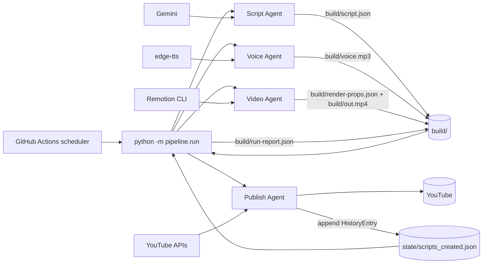
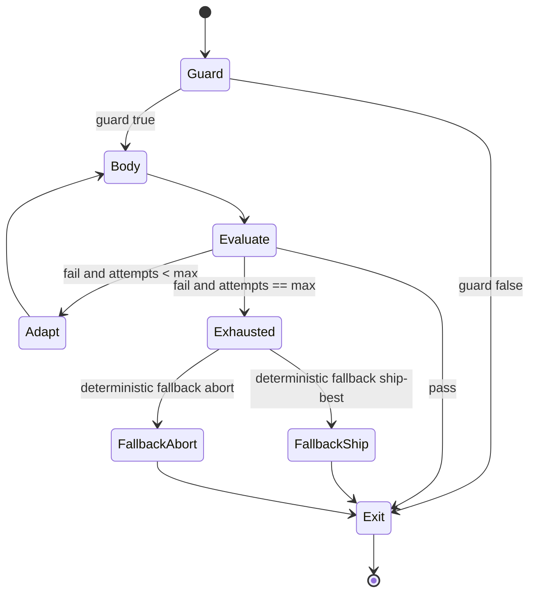
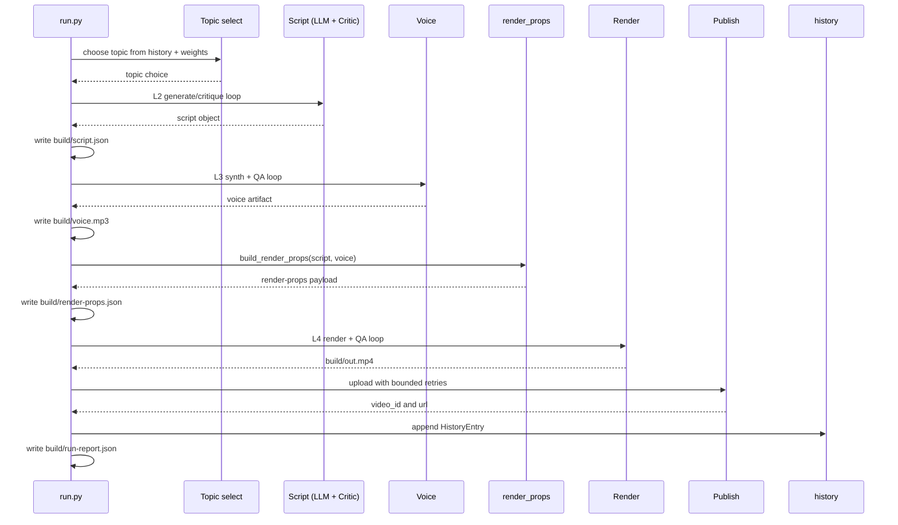
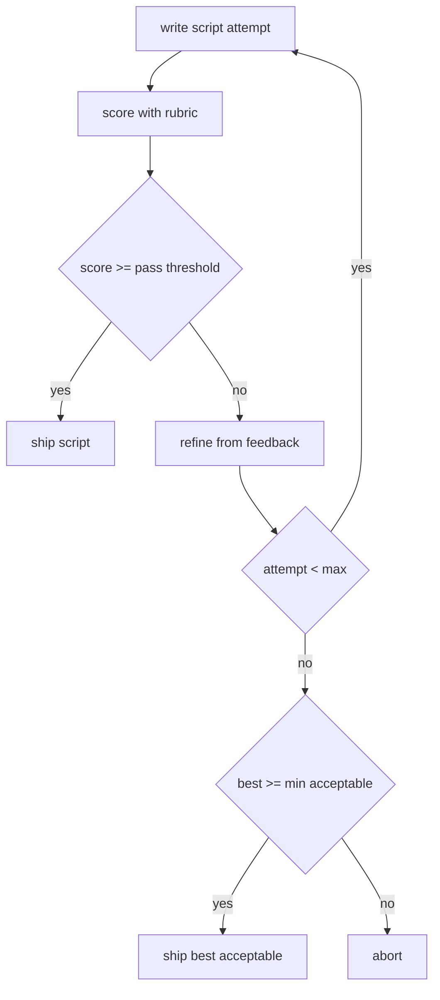
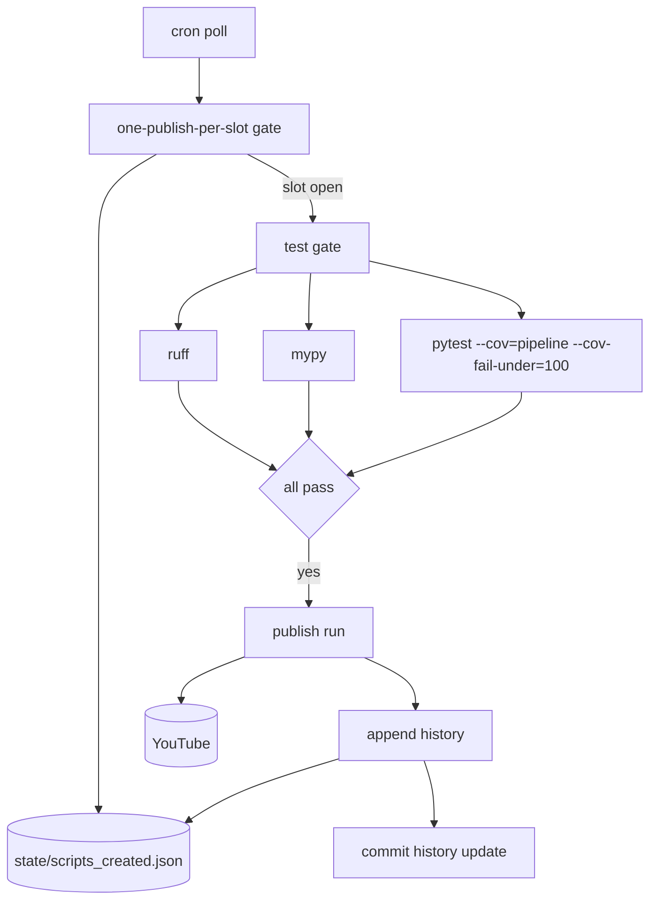

# AEC AI Shorts

AEC AI Shorts is a fully automatic, free-tool system that publishes one approximately 50-60 second vertical YouTube Short per day about AI in the AEC industry (Revit, Civil 3D, Navisworks/ACC, BIM, MEP, digital twins, and related workflows).

The key engineering point is not a linear four-stage pipeline. The architecture is five nested, bounded feedback loops with a single reusable control contract (`run_loop`). The loops, not the agents, are the system's reliability mechanism.

The four agents are Script, Voice, Video, and Publish. Only Script calls an LLM. Voice, Video, and Publish are deterministic control surfaces over tool adapters.

Core stack:

- Python orchestration in `pipeline/`
- Remotion TypeScript/React renderer in `remotion/` (1080x1920)
- GitHub Actions as free scheduler/runtime
- Local state only: `state/scripts_created.json` plus `build/` artifacts
- No server and no database

Free tools only: Gemini free tier, edge-tts, and Remotion.

## 1) What It Does: Loops Over Pipeline

The system ships one short per day, but that runtime behavior is governed by loop semantics:

- L0 Learning loop (across runs): YouTube stats -> topic/hook weights -> next script
- L1 Recurrence loop (per run): history memory enforces non-repetition
- L2 Script generate-critique loop: writer-evaluator rubric until quality bar
- L3 Voice QA loop: synthesize -> verify duration/pronunciation -> re-synthesize
- L4 Render quality-gate loop: render -> verify frames/duration -> re-render

Each loop obeys one contract: guard, body, monotonic best-so-far progress, termination predicate, hard max-iteration bound, deterministic fallback, and structured per-iteration observability.

## 2) Architecture

Caption: End-to-end architecture with scheduler, orchestrator, four agents, stores, and external services.



## 3) Five-Loop Topology And Shared Contract

Caption: L0 wraps L1; L1 mounts L2/L3/L4 and publish retry, with explicit feedback edges.

```mermaid
flowchart TD
  subgraph L0[L0 Learning loop (across runs)]
    STATS[YouTube stats]
    WEIGHTS[topic and hook weights]
    STATS --> WEIGHTS
  end

  subgraph L1[L1 Recurrence loop (per run)]
    HIST[(state/scripts_created.json)]
    TOP[topic_select]

    subgraph L2[L2 Script loop]
      W[write]
      C[critique]
      W --> C --> W
    end

    subgraph L3[L3 Voice QA loop]
      SYN[synthesize]
      VQA[voice_qa]
      SYN --> VQA --> SYN
    end

    subgraph L4[L4 Render gate loop]
      REN[render]
      RQA[render_qa]
      REN --> RQA --> REN
    end

    subgraph PR[Publish retry loop]
      UPL[upload]
      RET[retry/backoff]
      UPL --> RET --> UPL
    end

    HIST --> TOP
    TOP --> L2 --> L3 --> L4 --> PR
  end

  WEIGHTS --> L2
  PR -->|publish success| HIST
  PR -->|video performance| STATS
```

The reusable primitive is `run_loop` in `pipeline/loops.py`, and the common types are `Evaluation` and `ExitReason`. The loop always tracks monotonic best-so-far by `Evaluation.score`, logs every iteration (`loop_iteration`), logs every exit (`loop_exit`), and either exits by pass, guard fail, fallback accepted, or exhaustion.

Caption: Generic loop contract used by L2, L3, and L4.



Short `run_loop` usage sketch:

```python
from pipeline.loops import Evaluation, run_loop

result = run_loop(
    "L2.script",
    body=lambda attempt, prev_eval: writer.generate(attempt, prev_eval),
    evaluate=lambda artifact: critic.evaluate(artifact),  # returns Evaluation
    adapt=lambda artifact, ev: writer.refine(ev.feedback),
    on_exhausted=ship_best_or_abort,
    max_iters=cfg.script.max_attempts,
)
```

## 4) Per-Run Flow

Caption: Single run sequence with concrete artifact handoffs through build outputs.



Caption: Concrete L2 loop decision graph.



## 5) Repo And Module Map

| Area | Modules/files | Responsibility |
|---|---|---|
| Orchestration | `pipeline/run.py` | Run entrypoint that composes L0-L4 plus publish |
| Generic loop engine | `pipeline/loops.py` (`run_loop`, `Evaluation`, `ExitReason`) | Shared bounded-loop semantics |
| L1 state ledger | `pipeline/history.py` (`HistoryEntry`, `History`) | Non-repetition memory and post-publish append |
| Topicing | `pipeline/topic_select.py`, `pipeline/topics_aec.py` | Topic/hook selection and fingerprinting |
| L2 script | `pipeline/agent_script.py`, `pipeline/critic_script.py`, `pipeline/script_types.py`, `pipeline/llm_gemini.py` | Writer-critic loop; only LLM call site |
| L3 voice | `pipeline/agent_voice.py`, `pipeline/voice_qa.py` | TTS synthesis and QA/fix cycle |
| L4 render | `pipeline/agent_video.py`, `pipeline/render_props.py`, `pipeline/render_qa.py` | Render execution and output gating |
| Publish | `pipeline/agent_publish.py` | Upload retries and final history write |
| Analytics/L0 | `pipeline/analytics.py` | Stats -> weight updates for future runs |
| Config | `pipeline/config.py` | Env-driven loop bounds, thresholds, and tool knobs |
| Renderer | `remotion/src/` | 1080x1920 composition and scenes |
| CI | `.github/workflows/daily-short.yml`, `.github/workflows/healthcheck.yml` | Scheduler, gate checks, and operational health |
| Artifacts | `build/` | Run outputs (`script.json`, `voice.mp3`, `render-props.json`, `out.mp4`, `run-report.json`) |

`pipeline/render_props.py` enforces the renderer boundary with `REQUIRED_PROP_KEYS`, and each run emits `build/run-report.json` for auditability.

## 6) Quickstart

Install once, configure once, run dry, then publish.

### Install

```bash
python -m venv .venv
# Windows
.venv\Scripts\activate
# macOS/Linux
# source .venv/bin/activate

pip install -r requirements-dev.txt

cd remotion
npm install
npx remotion browser ensure
cd ..
```

### Configure `.env`

Set at minimum:

- `GEMINI_API_KEY`
- `YT_CLIENT_ID`
- `YT_CLIENT_SECRET`
- `YT_REFRESH_TOKEN`

Optional but commonly used:

- `YT_DATA_API_KEY`
- `REVIEW_BEFORE_PUBLISH`
- `ENABLE_ANALYTICS`

### Dry run (no upload)

```bash
python -m pipeline.run all --no-upload
```

Expected outputs: `build/script.json`, `build/voice.mp3`, `build/render-props.json`, `build/out.mp4`, `build/run-report.json`.

### First publish

```bash
python -m pipeline.run all
```

`HistoryEntry` is appended only after publish returns a valid `video_id`.

## 7) Configuration Surface

The configuration source of truth is `pipeline/config.py` via `load_config()`.

| Group | Variables | Purpose |
|---|---|---|
| `SCRIPT_*` | `SCRIPT_MAX_ATTEMPTS`, `SCRIPT_PASS_THRESHOLD`, `SCRIPT_MIN_ACCEPTABLE`, `SCRIPT_MIN_WORDS`, `SCRIPT_MAX_WORDS`, `SCRIPT_MIN_AEC_TERMS`, `SCRIPT_DEDUP_LOOKBACK`, `SCRIPT_DEDUP_JACCARD_MAX`, `SCRIPT_USE_LLM_JUDGE` | L2 script quality gates, retries, and dedup limits |
| `VOICE_*` and audio bounds | `VOICE_MAX_ATTEMPTS`, `MIN_AUDIO_SECONDS`, `MAX_AUDIO_SECONDS`, `MAX_EDGE_SILENCE_SECONDS`, `TTS_VOICE`, `TTS_VOICE_ALT`, `TTS_RATE`, `TTS_PITCH`, `TTS_VOLUME` | L3 synthesis policy and QA pass criteria |
| `RENDER_*` | `RENDER_MAX_ATTEMPTS`, `RENDER_DURATION_TOLERANCE`, `RENDER_MIN_OUTPUT_BYTES`, `RENDER_MIN_FRAME_LUMA`, `RENDER_WIDTH`, `RENDER_HEIGHT`, `RENDER_FPS` | L4 quality gates and output constraints |
| `REMOTION_*` and encode knobs | `REMOTION_CONCURRENCY`, `REMOTION_SCALE`, `REMOTION_GL`, `JPEG_QUALITY`, `CODEC`, `CRF`, `X264_PRESET`, `PIXEL_FORMAT`, `AUDIO_CODEC` | Render runtime/encode tradeoffs |
| `UPLOAD_*` and YouTube flags | `UPLOAD_MAX_RETRIES`, `UPLOAD_BACKOFF_BASE`, `UPLOAD_BACKOFF_CAP`, `YT_CATEGORY_ID`, `YT_PRIVACY`, `YT_MADE_FOR_KIDS`, `REVIEW_BEFORE_PUBLISH` | Publish retry behavior and metadata policy |
| `ANALYTICS_*` | `ENABLE_ANALYTICS`, `ANALYTICS_MIN_UPLOADS`, `ANALYTICS_LOOKBACK`, `ANALYTICS_WEIGHT_FLOOR` | L0 adaptation policy |
| Tool/API config | `GEMINI_MODEL`, `YT_DATA_API_KEY`, `SLACK_WEBHOOK_URL` | Provider/model and notifications |
| Paths | `STATE_DIR`, `BUILD_DIR`, `HISTORY_PATH` | Local persistent state and artifact roots |

## 8) CI And Scheduling

Caption: Slot gate plus quality gate before publish and history commit.



The scheduler is GitHub Actions, so there is no dedicated always-on service. Each run is bounded, observable, and leaves artifacts for post-run inspection.

## 9) Testing Philosophy: Prove The Loops

The testing target is loop correctness, not just helper correctness. Tests focus on control-system behavior:

- bounded iteration and guaranteed termination
- monotonic best-so-far selection under oscillating quality
- explicit exit semantics (`ExitReason`) and fallback handling
- recurrence invariants around `HistoryEntry` append timing and dedup checks
- render/voice contract validation, including `REQUIRED_PROP_KEYS`
- adapter boundaries mocked or probe-injected for Gemini, edge-tts, ffmpeg/mutagen, and YouTube client

Verified in this repository state:

- `199 passed` (from local `pytest` run)
- `100%` coverage on `pipeline/`
- CI quality gate policy: `--cov-fail-under=100`

This is the practical meaning of "prove the loops, not just the functions."

## 10) Setup Pointer And Security

For first bootstrap and operator checklist, see `FIRST_RUN.md`.

Security policy:

- never commit `.env`
- never commit API tokens or OAuth secrets
- rotate credentials immediately if exposed

The only persisted runtime data should be `state/scripts_created.json` and `build/` artifacts.
